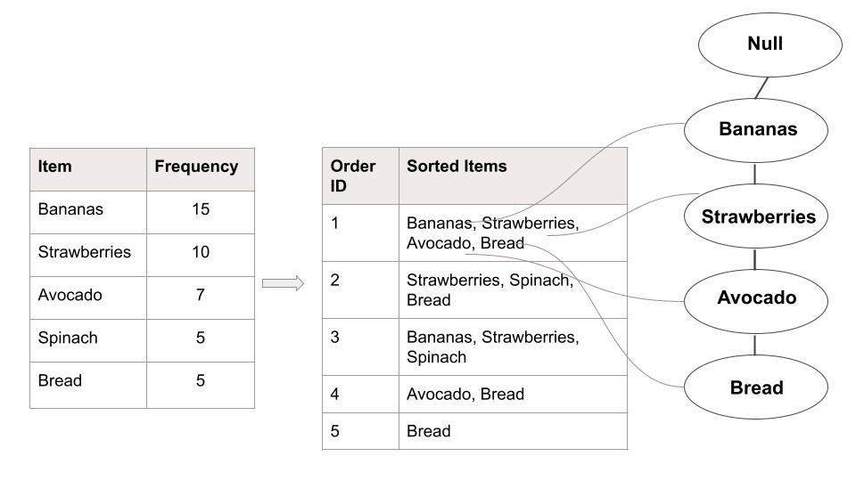

# Capstone: Market Basket Analysis
Capstone Project at the General Assembly, 2021

### Table of Contents

### Problem Statement

Analyze Instacart dataset and determine market basket mix based on previous customer order history. 

### Executive Summary

In this work, I analyze Instacart orders dataset to make predictions about future customer purchases.

### Background Research

Instacart is an online grocery delivery service from stores such as Mariano’s, Jewel-Osco, Target, Costco, and many more. The company’s business model is based on connecting four sides of a trade: Customers, Product Advertisers, Shoppers, and Retailers. Instacart Revenue comes from delivery fees, often annual memberships, partnerships from companies like Procter & Gamble (30% of all purchases made on the Instacart platform comes from advertisement), and some stores are willing to pay if the delivery service can increase store visits. It is known for its easy-to-use UI, where users have an option to choose the delivery window. Please refer to EDA folder/EDA.ipynb for details on order placement details, including peak and slow hours. 

90% of Instacart’s customers are returning customers, while express customers spend on average USD500 a month. The company allocates substantial resources to estimate customer demand, including building probabilistic models on potential customer demand given 100% supply availability. Weather is an important factor in demand estimation for the company as more customers tend to order groceries online if it is cold, snowing, or raining and the opposite if the weather is warm and sunny. Another important piece that Instacart forecasts is order fulfillment time - the company uses in-house route algorithm, rather than using Google Maps and employs gradient boosting decision trees model as it encounters a lot of variation and this model is prone to overfitting. 

In 4Q2020, Instacart raised USD200 million doubling the company valuation since the beginning of 2020 increasing to USD17.7 billion. The company benefited from surged demand in online grocery deliveries as a result of coronavirus pandemic. In the 1H2020, Instacart increased number of shoppers from under 100,000 to 400,000 and expected company Revenue to hit USD35 billion. 

### Model Details

FP-Growth (Frequent Pattern) is a significantly more efficient algorithm compared to Apriori as the dataset does not need to be scanned over and over again and no candidate generation is required. It scans the dataset and counts frequencies of each item in a dataset, sorting them in descending order and leaving items that are at or above a state support level. The algorithm then loops through the remaining itemsets to build FP-tree of nodes starting from the root - the most frequent occurring item - then the next until it reaches the least represented item in a dataset. When items are not part of the branch, a new branch will be created. The algorithm employs a recursive divide-and-conquer approach to identify frequent itemsets traversing the FP-tree. 

Having done these two steps of data sorting, the algorithm scans for itemsets with support level at least the specified level (e.g. 1000). The FP-trees are built in a way that the root of a tree is conditional upon an item and recursively counts the frequency of the item spotted in an itemset. It works based on a notion that If an item occurs frequently, then a subset(s) of that item should also occur frequently. 

**Visual Representation of the FP-Growth Algorithm**

### Key Findings and Recommendations

**Promotions and Cross-selling**

Based on the Frequent Item Analysis performed in this work, I would recommend cross-selling and running cross - promotions on items that are frequently purchased together. I noted that ‘bananas’ and ‘organic bananas’ are the most frequently purchased items and an antecedent to many products that are usually priced higher. A bunch of organic bananas is priced between USD1.50 - USD2.50 depending on the retailer (quote source: instacart.com), while some of the consequent items are priced at:

- Bag of clementines USD6.99
- 100% whole-wheat bread USD3.09 - USD6.30
- Red vine tomatoes 4ct USD4.09
- Hass avocados USD3.29 - USD6.79

I would consider offering discounts on bananas, organic bananas to engage customers to start shopping. As customer starts a shopping cart, they likely would be interested in exploring other products even if these products are priced higher. The dataset is from an online grocery delivery service and the business has an opportunity to offer online recommendations suggesting product(s) that were often purchased together by other customers in the past. Compared to the Recommendation algorithm using collaborative filtering, association rules does not capture individual preferences and rather looks for relationships between items within each distinct transaction. It provides avenues to making product suggestions based on customer searches and, if executed diligently, improves customers experience and an increase in sales for retailers. 

**Store Layout example**

I created Tableau dashboards to illustrate relationships between store aisles and store departments. Details of the two dashboards can be found here (https://tabsoft.co/3b0xoCq). Based on the FP-Growth Algorithm and Tableau dashboards, I recommend the following store layout. Please note that layout excludes certain departments as they did not prove to  indicate strong association rules patterns.

### File Directory

### Data Dictionary

### Citations
See sources.md